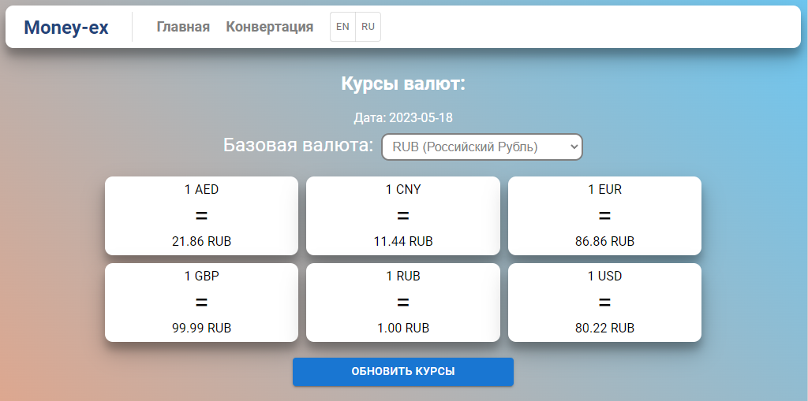
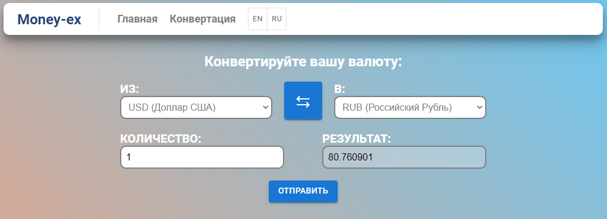

<div id="top"></div>

# Money-ex

**Money-ex** - Приложение (онлайн-калькулятор) для конвертирования валют.



## Разработано с использованием:


 


- API: [Exchangerate.host](https://exchangerate.host/#/)

## Дополнительные инструменты:


## Описание страниц:
### Главная страница:

- Отображает список валют относительно базовой валюты — например, если базовая валюта — рубль, то пользователь видит, что 1 USD = 70.00 RUB, а 1 EUR = 80.00 RUB.
- По-умолчанию у пользователя определяется «базовая» валюта - RUB, которую можно настроить. 
- Курсы валют автоматически обновляются каждую минуту.
- Имеется кнопка принудительного обновления курсов валют.
 
### Страница с конвертером из одной валюты в другую:

- На этой странице присутствует поле, для ввода суммы необходимой для конвертации. Также имеется валидация введенной суммы (можно вводить только цифры и знак точки).
- Имеются выпадающие списки для выбора из какой валюты производить конвертацию и соответственно в какую валюту.
- Имеется кнопка быстрой взаимной смены валюты "из" и валюты "в". Пример: конвертировали из usd в rub, а нужно то же значение конвертировать из rub в usd.

### Дополнительные задачи:

- Реализована локализация страниц на 2 языка: Русский и Английский.\
- Реализован переключатель языков.
- Реализована валидация введенной суммы (можно вводить только цифры и знак точки).
- Реализован адаптивный дизайн страниц.

## Установка

1. Склонируйте репозиторий:

   ```sh
   git clone https://github.com/exekuta/money-ex.git
   ```

2. Установите зависимости

   ```sh
   cd money-ex
   yarn install
   ```

3. Для старта проекта наберите

   ```sh
   yarn watch
   ```
Приложение запустится по адресу `localhost:3000`.


<p align="right">(<a href="#top">back to top</a>)</p>
